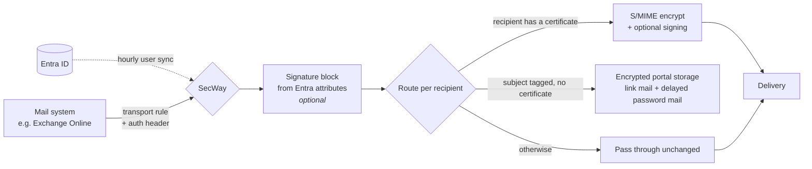

  

<h1 align="center">SecWay</h1>

  <strong>Secure mail gateway</strong> — transparent S/MIME encryption, signature verification,
  certificate harvesting, server-side signature blocks and a password-protected recipient
  portal as fallback. 
  Self-hosted, built with Laravel &amp; Postfix.

---

## What it does

SecWay sits between your mail system (e.g. Exchange Online) and the internet. Every outbound
message is routed through the gateway, which decides automatically how to deliver it securely —
senders don't need to install anything, think about certificates or change how they work.
Recipients with S/MIME get seamless end-to-end encryption; everyone else gets a clean,
self-hosted web portal. Inbound encrypted mail is decrypted centrally, so it stays readable,
searchable and archivable in your users' mailboxes.

### Outbound — three-way routing

- **S/MIME** — if an active certificate exists for the recipient address or domain, the message
  is encrypted (and optionally signed) automatically. No subject tag needed.
- **Portal** — if the sender tagged the subject (default `[sicher]`) and no certificate exists,
  the message and its attachments are stored encrypted on the gateway. The recipient gets a
  link by mail and — configurable minutes later — a password in a separate mail.
- **Pass-through** — everything else is delivered unchanged.

### Inbound

Mail addressed to your own domains is decrypted with your own certificates, S/MIME signatures
are verified (result recorded in an `X-MGW-Signature` header) and sender certificates are
**harvested** from trusted signatures — so the next reply to that sender is encrypted
automatically and the encryption loop closes by itself.

### Signature blocks (optional)

An optional module appends a server-side **signature block** (the footer at the end of a mail)
to outbound messages, filled per sender with attributes from **Entra ID** (Microsoft 365) via
Microsoft Graph. Users don't maintain their own footers — the gateway adds a consistent,
central signature on the way out. WYSIWYG editor (self-hosted TinyMCE), placeholders with conditional blocks,
inline images and **QR codes** (e.g. vCard) embedded per sender, and rules per block
(sender/recipient include+exclude, internal/external direction, validity period, priority,
continue-or-stop). Optionally it also **updates the sent copy** in the user's *Sent Items*
folder with the signed version. Disabled by default; needs no extra Exchange rule (it runs on
mail already routed through the gateway). "Signature block" is deliberately distinct from the
cryptographic S/MIME **signing** above.

## Features

- **Zero client footprint** — no plugins, no per-user setup; routing decisions are automatic
- **Recipient portal** — token link + password (delivered time-shifted), brute-force lockout,
  download tracking, automatic reminders, automatic expiry and irreversible deletion
- **Certificate management** — upload (PFX/PEM) for addresses or whole domains, automatic
  harvesting from verified inbound signatures, expiry overview
- **Admin UI** (German) — statistics dashboard, message list with remind/delete, live Postfix
  queue view with re-deliver/delete, structured audit log grouped per mail, all settings editable
- **Operations built in** — health monitoring with alerting and mail-loop emergency brake,
  nightly backups (restore-tested), fail2ban integration, GDPR pages maintainable in the admin UI
- **Fail-safe by design** — if encryption fails (e.g. expired certificate), the message goes
  to the portal instead of leaving in plaintext; missing auth header defers (TEMPFAIL) instead
  of dropping mail; everything the gateway sends is loop-protected via `X-MGW-Notification`
- **Standards-based S/MIME cryptography** — sign-then-encrypt with AES-256-CBC content
  encryption, RSA (PKCS#1 v1.5) key transport, SHA-256 RSA signatures; interoperates with
  common gateways and mail clients
- **Signature-block module** (optional) — server-side e-mail footers from Entra ID with
  placeholders, rules, inline images, per-sender QR codes and optional Sent-Items update

## Requirements

| Component | Version |
|---|---|
| Debian | 12/13 (other distros work, paths differ) |
| PHP | 8.3+ (`openssl`, `mbstring`, `xml`, `curl`, `mysql`, `intl`, `bcmath`, `zip`, `gd`) |
| Laravel | 13 (installed via Composer) |
| MariaDB | 10.11+ |
| Postfix | 3.7+ |
| nginx + certbot | current |

A mail system in front (Exchange Online, any SMTP server) that routes outbound mail through
the gateway and adds the shared-secret header.

The **signature-block module** additionally needs the `gd` PHP extension (QR codes), a
one-time TinyMCE download (see INSTALL) and a Microsoft Graph app registration; it is optional
and off by default.

## Installation

See **[docs/INSTALL.md](docs/INSTALL.md)** for the full walkthrough (packages, database, nginx,
Postfix content filter, mail-system connectors, cron, fail2ban, first login).

German operations manual: **[docs/OPERATIONS.de.md](docs/OPERATIONS.de.md)**.

## Configuration

Defaults live in [`.env.example`](.env.example); everything marked *admin* is maintained at
runtime under *Admin → Einstellungen* and stored in the database.

| Setting | Where | Purpose |
|---|---|---|
| `MGW_INGEST_SECRET` | `.env` | Shared secret the upstream mail system must send as `X-MGW-Auth` header |
| Operator name | admin | Name recipients see in the portal and notification mails |
| Internal domains | admin | Recipients of these domains are treated as **inbound** |
| Subject tag | admin | Trigger for portal delivery (default `[sicher]`), stripped before delivery |
| Retention days | admin | Portal storage lifetime, then irreversible deletion |
| Password delay | admin | Minutes between link mail and password mail |
| Reminder hours | admin | Auto-remind recipients who haven't picked up (0 = off) |
| S/MIME auto-encrypt / sign | admin | Encrypt whenever a certificate exists; sign when sender has own key |
| Impressum / privacy policy | admin | Legal pages served at `/impressum` and `/datenschutz` (HTML) |
| `GRAPH_*` | `.env` | Microsoft Graph app credentials for the signature-block module (optional) |
| Signature blocks + rules | admin | Templates, per-sender/recipient rules, images, QR codes, on/off, Sent-Items update |

Admin login is by **username** (created at install, changeable under *Admin → Konto* together
with the password).

## Architecture

| Piece | Role |
|---|---|
| Postfix `smtpd` | Accepts mail from the upstream system, enforces the auth header |
| `mail:ingest` (pipe filter) | Parses the message, routes S/MIME / portal / pass-through, re-injects |
| Laravel app | Portal, admin UI, S/MIME services (`app/Services/Smime*`) |
| Scheduler (cron) | Delayed passwords, reminders, expiry purge, hourly Entra sync, Sent-Items update |
| Signature-block module | `app/Services/Signature*`, Microsoft Graph client, TinyMCE editor, QR via `endroid/qr-code` |
| `ops/` scripts | Health check + loop brake, nightly backup, queue-delete helper |

Message bodies and attachments are stored encrypted at rest (AES-256-GCM with a per-message
data key, wrapped with the Laravel `APP_KEY`); own private S/MIME keys are stored encrypted;
portal passwords are stored as bcrypt hashes only. Every action is written to an audit log.

## Status & roadmap

In production at a German non-profit since 2026, including the signature-block module.
Roadmap: signing internal-to-internal mail (needs the routing rule widened to internal
recipients), reply-from-portal for external recipients, optional AES-GCM/OAEP cipher profile.

## License

Copyright © 2026 Dietmar Möller

SecWay is free software: you can redistribute it and/or modify it under the terms of the
**GNU Affero General Public License, version 3 or later** (AGPL-3.0-or-later) as published by
the Free Software Foundation. It is distributed in the hope that it will be useful, but
**without any warranty**; without even the implied warranty of merchantability or fitness for
a particular purpose. See the [LICENSE](LICENSE) file for the full text.

The AGPL is a strong copyleft license: if you modify SecWay and let others use it — including
**over a network** as a hosted service — you must make your modified source available to those
users under the same license.
